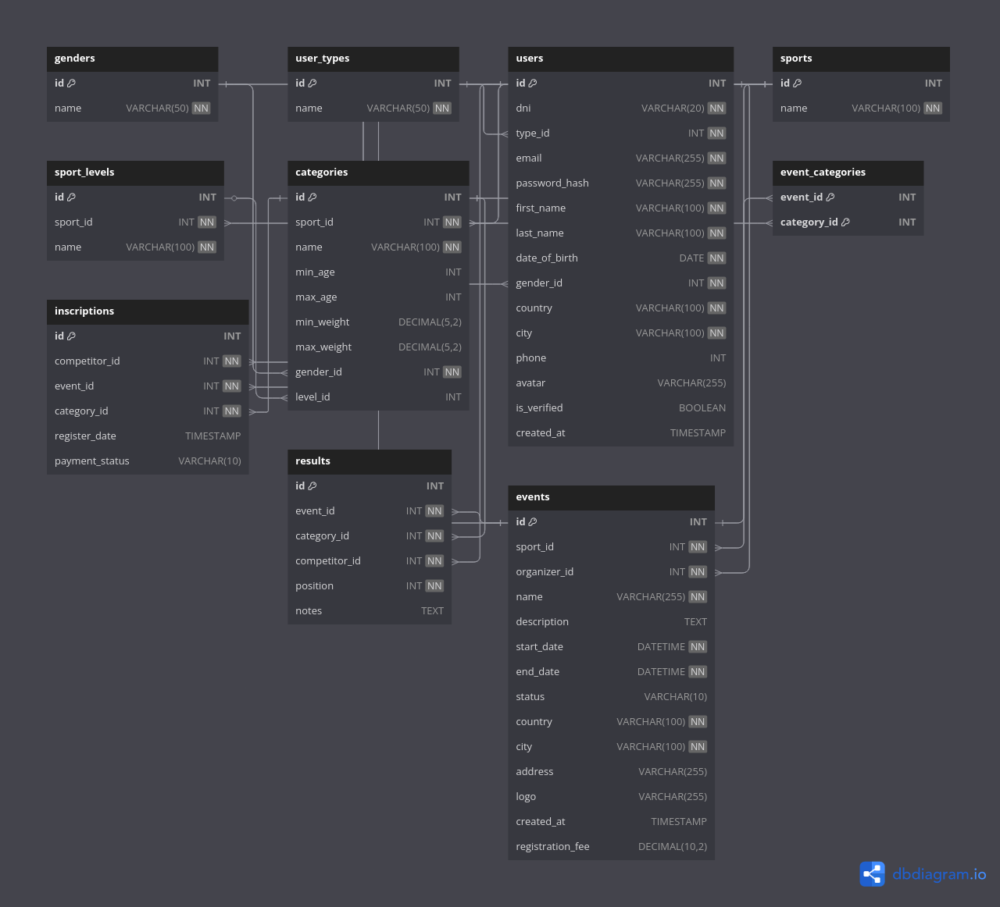

# Tapped Out - Sports Event Management Platform


> Copyright © 2025 Tapped Out. All rights reserved

## 📕 Table of contents

- [Project Overview](#🔎-project-overview)

- [Database Structure](#⛁-database-structure)

    - [Diagrams](#diagrams)

    - [Key Tables](#key-tables)

- [Backend Implementation](#☕︎-backend-implementation)

    - [Dependencies](#dependencies)

    - [Configuration](#configuration)

- [Frontend Implementation](#⚛-frontend-implementation)

- [Getting Started](#getting-started)

- [License](#license)

## 🔎 Project Overview

Tapped Out is a comprehensive platform for organizing combat sports events. The system provides:

- Event creation and management.

- Competitor registration.

- Category organization by age, weight, gender...

- Result tracking and reporting.

- User management for organizers and competitiors.

The technical stack includes:

- **Backend**: Spring Boot (Java) v.3.4.5

- **Frontend**: React with Vite

- **Database**: MySQL

## ⛁ Database Structure

The database is designed to support complex event management with multiple sports, categories, user types, results and users, and the relations stablished between this models.

### Diagrams

The following are Entity-Relation Diagrams showing the relations between tables.

Diagram manually created at [UMLetino](https://www.umletino.com/umletino.html)


Diagram automatically created at [DBDiagram](https://dbdiagram.io/home) prompting the database creation script.



### Key Tables

- **Users**: Stores all the information with different types (organizers, competitors)

- **Sports**: Defines different ombat sports supported.

- **Categories**: Organizes competitors by age, weight, gender and skill level.

- **Events**: Central table for all tournament information.

- **Inscriptions**: Tracks competitor registrations at different events.

- **Results**: Records tournament outcomes.

## ☕︎ Backend Implementation

The backend is a RESTful API designed with Java Spring Boot version 3.4.5.

### Dependencies

| DEPENDENCY | PURPOSE |
| :--- | :--- |
| Spring Web | REST API developement |
| Spring Boot DevTools | Developement tools (helps avoiding console) |
| Lombok | Reduced boilerplate code |
| Spring Data JPA | Database access and persistance |
| MySQL Driver | Connection with database |
| Spring Security | Authentication and authorization |
| Validation | Request different validations easily |
| Java Mail Sender | Email notifications |
| Spring Session | Session management |
| Springdoc OpenAPI | API documentation (Swagger) |

### Configuration

#### application.properties

Change lines with the data you need for your project (email token, db user and password...)

```properties

spring.application.name=TappedOut

#=================
# SERVER CONF 
#=================

# Port
server.port=9000

# Uploaded files
spring.servlet.multipart.max-file-size=10MB
spring.servlet.multipart.max-request-size=10MB

# Custom paths for files
tappedout.uploads.dir=../../../Uploaded_files
tappedout.logs.dir=../../../Logs

#=================
# DATABASE MYSQL
#=================

spring.datasource.url=jdbc:mysql://localhost:3306/tapped_out?useSSL=false&serverTimezone=UTC
spring.datasource.username=your_username
spring.datasource.password=your_password
spring.datasource.driver-class-name=com.mysql.cj.jdbc.Driver

# JPA
spring.jpa.hibernate.ddl-auto=update
spring.jpa.show-sql=true
spring.jpa.properties.hibernate.format_sql=true
spring.jpa.properties.hibernate.dialect=org.hibernate.dialect.MySQL8Dialect

#=================
# JAVA MAIL SENDER
#=================

spring.mail.host=smtp.gmail.com
spring.mail.port=587
spring.mail.username=your_email_directions
spring.mail.password=your_email_app_token
spring.mail.properties.mail.smtp.auth=true
spring.mail.properties.mail.smtp.starttls.enable=true
spring.mail.properties.mail.smtp.connectiontimeout=5000
spring.mail.properties.mail.smtp.timeout=5000
spring.mail.properties.mail.smtp.writetimeout=5000
spring.mail.default-encoding=UTF-8

#=================
# SWAGGER
#=================

springdoc.api-docs.path=/api-docs
springdoc.swagger-ui.path=/swagger-ui.html
springdoc.swagger-ui.tagsSorter=alpha
springdoc.swagger-ui.operationsSorter=alpha

```

#### logback-spring.xml

Logback is a Spring Boot integrated dependency that allows to track logs made at the server. You need to configure how you want the logs to be stored.

1. Create `logback-spring.xml` in the same path as `application.properties`.

2. Define your configuration for logs.

The following is a configuration where logs are stored ad `../../../Logs` with daily rotation (creates 1 log file / day):

```xml

<configuration>

    <property name="LOG_PATH" value="../../../Logs"/>
    <property name="LOG_PATTERN" value="%d{yyyy-MM-dd HH:mm:ss} [%thread] %-5level %logger{36} - %msg%n"/>

    <appender name="FILE" class="ch.qos.logback.core.rolling.RollingFileAppender">
        <file>${LOG_PATH}/tappedout.log</file>
        <rollingPolicy class="ch.qos.logback.core.rolling.TimeBasedRollingPolicy">
            <fileNamePattern>${LOG_PATH}/tappedout.%d{yyyy-MM-dd}.log</fileNamePattern>
        </rollingPolicy>
        <encoder>
            <pattern>${LOG_PATTERN}</pattern>
        </encoder>
    </appender>

    <appender name="CONSOLE" class="ch.qos.logback.core.ConsoleAppender">
        <encoder>
            <pattern>${LOG_PATTERN}</pattern>
        </encoder>
    </appender>

    <root level="INFO">
        <appender-ref ref="CONSOLE" />
        <appender-ref ref="FILE" />
    </root>

</configuration>

```

## ⚛ Frontend Implementation

## Getting Started

## License